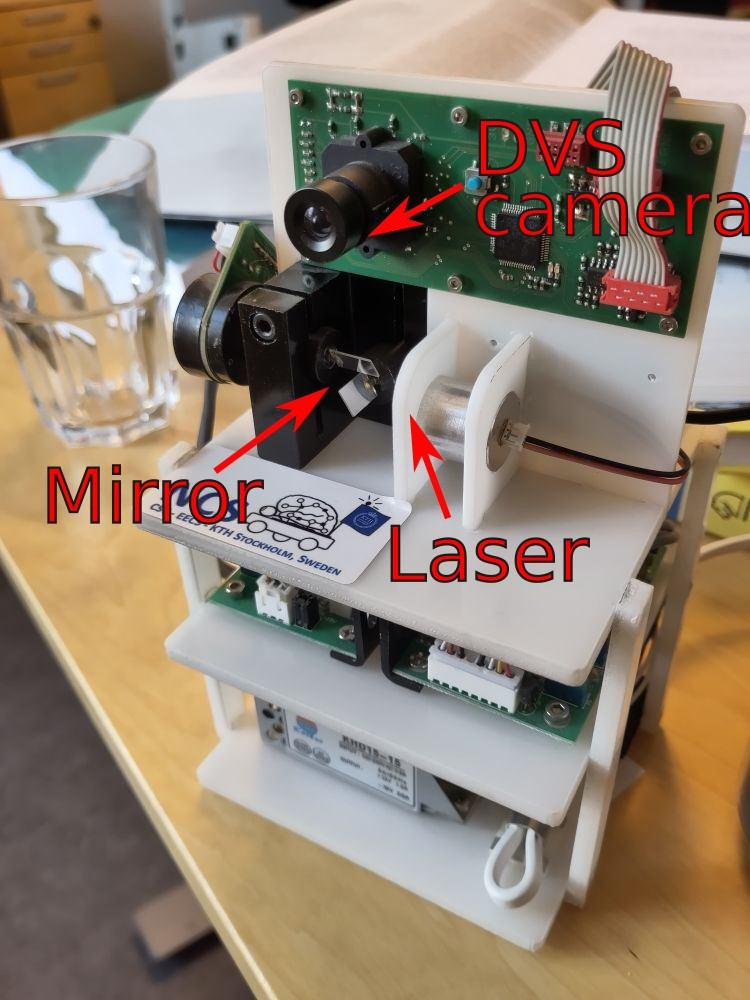

# Real-time event-based laser tracking at CapoCaccia 2023

The goal of this setup was to use a galvanic mirror-controlled laser and event camera (see picture) to track a laser pointer controlled by a human in real-time.

**Equipment**: Galvanic mirror system with event camera (picture). Laser pointers emitting at 300Hz, 900Hz, and 2000Hz. 2 x DXplorer cameras (640x480 resolution) to change the perspective. NVIDIA 3070 GPU for compute.

**Challenges**:
* Learn mapping from event camera to laser position
* Distinguish "efferent" laser pointer from human laser pointer (optional)
* Adapt to changing camera positions over time (optional)

**Requirements**:
* [AEStream](https://github.com/aestream/aestream) for streaming events from our cameras.
* [Laser](https://github.com/ncskth/laser) for controlling the galvanic mirror laser.

## Approaches
The following approaches were pursued:

### BBB (Braitenberg)
A [Braitenberg vehicle](https://en.wikipedia.org/wiki/Braitenberg_vehicle) that continuously tries to move closer to the goal.

## PD-controller
A proportional-integral controller that minimizes the current (and predicted) error.

## PD-controller (learnt)
A proportional-integral controller that tries to learn an improved mapping from camera space to laser space with gradient descent.

https://github.com/Jegp/23_capocaccia_laser/raw/main/pd_learnt.mp4

https://github.com/Jegp/23_capocaccia_laser/raw/main/pd_learnt2.mp4

## DQN
A deep Q network that trains on the mapping with reinforcement learning.

## Spiking arrows (GeNN)
A spiking neural network in [GeNN](https://genn-team.github.io/) available here: https://github.com/juleslcmt/spiking_arrows

[Presentation slideshow available as a PDF](spiking_arrow_pres.pdf)

## SNN PD controller
A PD controller in [Norse](https://github.com/norse/norse) tracking the laser (in the `ccw-laser-tracking` folder).

https://github.com/Jegp/23_capocaccia_laser/raw/main/ccw.mp4

https://github.com/Jegp/23_capocaccia_laser/raw/main/ccw2.mp4

## Dynamic neural field (DNF)
Uses dynamic neural fields to track laser dots. Based on the paper [Learning to Look: A Dynamic Neural Fields Architecture for Gaze Shift Generation](https://link.springer.com/chapter/10.1007/978-3-319-11179-7_88) by Christian Bell, Tobias Storck & Yulia Sandamirskaya .

## Acknowledgements
The dedicated team working on the approaches consisted of (in alphabetical order):
Chiara Bartolozzi, Luna Gava, Antoine Grimaldi, Mitra Hartmann, Michael Hopkins, James Knight, Jules Lecompte, Antony N'dri, Jens E. Pedersen, Luca Peres, Yulia Sandamirskaya, Thomas Tiotto, Chenxi Wen.

Thank you for all your work and efforts!
